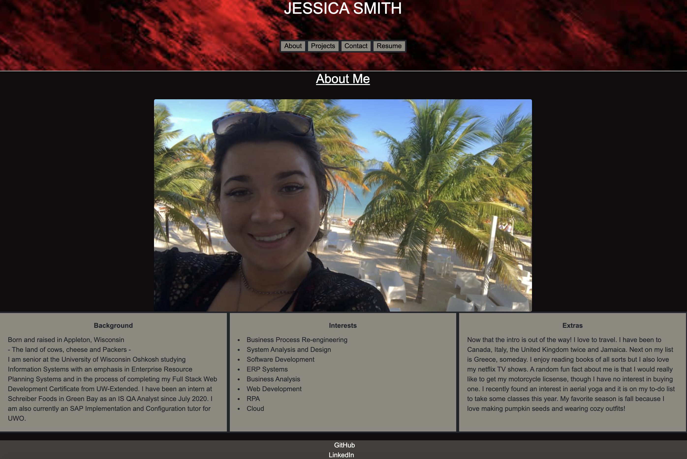

# React Portfolio

## Description
This is a portfolio created with React for to showcase my projects. There is an "About" page, a "Projects" page, a "Contact" page, and a "Resume" page in a nav bar at the top of the screen. Each will take you to the corresponding page to either learn about me, see my projects, contact me, or download my resume.

## Technologies
The technologies used in this are React, CSS, and Bootstrap.

## Usage
For future employers or anyone interested to take a look at my work or learn a little about me!

## Future Development
In the future I'd like to add more styling to this and make it more exciting. 

## Screenshot of Application

## Link to Deployed Application

[Portfolio](https://warm-springs-29427.herokuapp.com/#about)